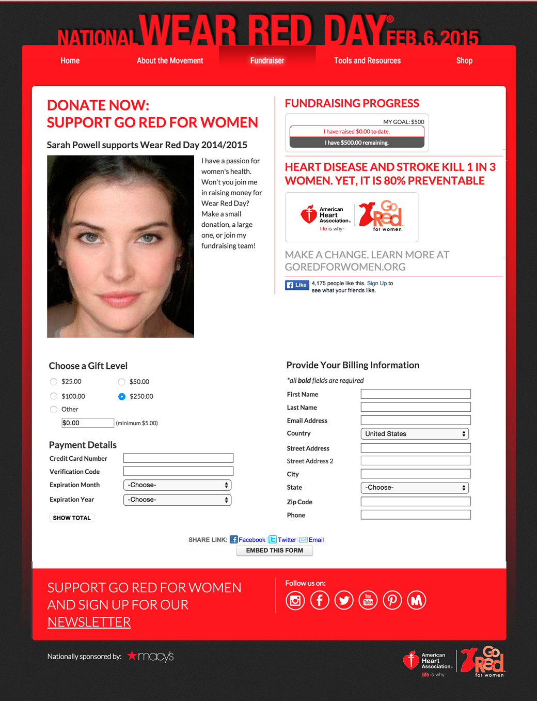

## Challenge

* Portable forms had already increased donations
* Needed new ways to motivate giving
* Required feature parity in fundraising teams

## Approach
I recalled how sharing personal stories had motivated content authorship at a prior startup.
I suggested that we let donors tell others *why* they give.
At the very moment someone was motivated to give money, provide ways for them to enlist others.
This began with a set of social links, and grew to become personalized appeals for giving.

### Single Page Application: Advocate Center

* Author personal statement about a cause 
* Upload photos and video
* Invite others to give and join teams
* Edit personal profile at any time

### Personalization Components

* Components deliver personal appeal in giving context
* Any page composition with components for:
  - Generic Form
  - Personal Photo or Video
  - Statement
  - Fundraising goal and progress
* Special identifier activates personal components
* Option to join team and donate

## Results

* Record levels of giving

