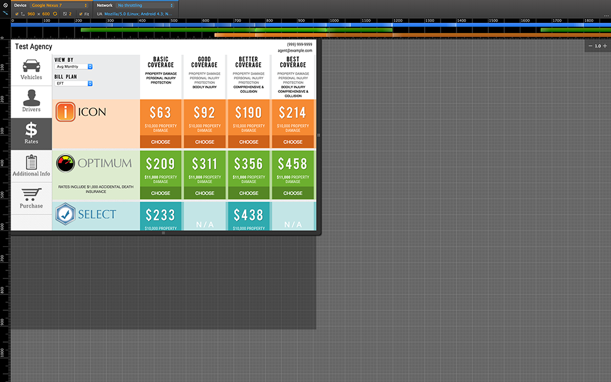

## Challenge
* Auto insurance consumers compare brands and purchase 
* Single page application in beta
* Costly maintenance, with ~ 2200 lines of custom CSS (50%)
* Must become mobile-responsive
* Needed to accept private-label brands
* Rapidly evolving business rules

## Approach
* Establish support matrix for screens small as 360px
* Rethink grid layouts with Bootstrap
* Gradually replace custom styling
* Write Ember code for new features and interactions

## Results
* Reaches variety of mobile-only customers
* Increases touch-free sales, savings for agents
* Saves money with shorter approval loops and a free license
* Reduces regression risk
* Less proprietary code to manage
* Easy handoff to client / well-understood standards

  <ul>
    <li><a href="responsive-ecommerce.png" target="_blank">Responsive eCommerce Web App
        
        Ember, Handlebars, Elixir, Couchbase, Compare &amp; Buy
      </a>
    </li>
  </ul>

